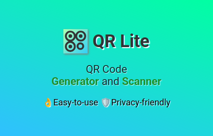

# QR Lite

QR Lite is a browser extension for generating and scanning QR codes offline.

> Although Chrome is supported, this extension is NOT available on Chrome Web Store, you have to build and install it from source yourself.

## Features

- Generate QR code for current tab in popup.
- Generate QR code for selected link/text.
- Change error correction level of generated QR code.
- Scan QR codes in images.
- Keep track of generating and scanning history.

## Permissions

QR Lite requires the following permissions:

- Access to the active tab (`activeTab`): mandatory, enables capturing image of the active page for scanning
- Context menus (`contextMenus`): mandatory, enables the context menu items
- Storage (`storage`): mandatory, enables preferences and history persistence on disk
- Clipboard write (`clipboardWrite`): mandatory, enables copying QR code images or text to clipboard
- Scripting (`scripting`): mandatory, enables script injection for the following scenarios:
  - When _Select region to scan.._ is chosen, a script need to be injected to the active page to load the "scan region picker" UI
  - When _Scan QR code in Image_ is chosen, a script need to be injected to the active page to retrieve the image data
- Access to all websites (`<all_urls>`): optional, required to read image data from websites when you click "Scan QR code in image" in the context menu. Also in older Firefox versions, this permission is also needed to capture image of the web page.
- Camera access: optional, enables QR code scanning with camera

## Development

Prerequisites: yarn, pnpm(qr-scanner-wechat)

1. Clone this repo and sync the submodules.
1. Run `yarn` to install dependencies.
1. Run `yarn dev` to watch source files and automatically build the add-on when they change.
1. Use your browser's "Load unpacked extension" feature to load the extension at
   `dist/{firefox,chrome}/manifest.json` in the project root.

Use the script in `/opencv` to update the pre-built OpenCV library and wasm.

## Building

Build steps on Linux:

1. Make sure you have `node`, `yarn`, and the `zip` command installed.
1. Open terminal and cd to project root.
1. Run `./scripts/release.sh`. After this you'll get two zip files in the `release` directory: `qr-lite-release-xxxxxxxx.zip`
   is the installable extension, while `qr-lite-source-xxxxxxxx.zip` is the source code zip.

## Localization

As of now, QR Lite supports the following languages:

- English
- 中文
- 日本語

You're welcome to help translate QR Lite into your language, just submit a pull request.

## Credits

- [ZXing for JS](https://github.com/zxing-js/library) for generating QR code.
- [OpenCV + wechat_qrcode](https://docs.opencv.org/4.9.0/dd/d63/group__wechat__qrcode.html) for decoding QR code.
- [Javascript QR Code](https://addons.mozilla.org/zh-CN/firefox/addon/javascript-qr-code/) for the initial code base.

## License

MIT
